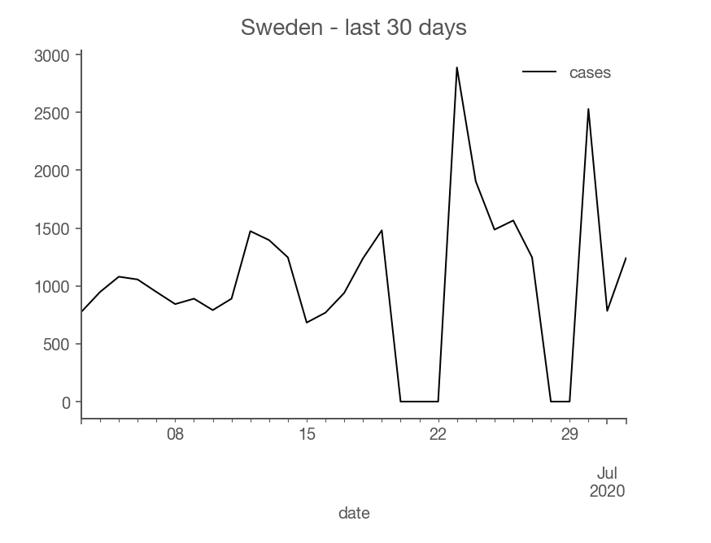

Back in March, I was sitting at home and watching COVID-19 case numbers rise at different rates across the world. It was also the time of
lockdowns of varying strictness imposed in Europe. The disruption brought to everyone's life has been colossal, and I wondered how to make up
my mind on what I was seeing around me. Is locking down everyone at home necessary? Does closing the borders make any sense?

As I pondered these questions and I was getting myself up-to-speed with the science of tracking epidemics, I came across Kevin Systrom's early attempts to estimate the rate at which the virus spreads. The metric he was calculating is called the effective reproduction number, named Rt by epidemiologists.
It's a metric tracking the average number of people infected by a single person.

Many [prominent](https://www.nytimes.com/2020/04/06/opinion/coronavirus-end-social-distancing.html) [experts](https://www.gatesnotes.com/Health/Pandemic-Innovation) specializing
in infectious diseases argue that Rt is the single most important metric we should track. That number determines whether we have the virus under control or seeing an early
warning sign of a trajectory leading to hotspots like northern Italy, Spain, the UK, or New York. Even small differences in Rt, when played out over weeks, lead to vastly
different outcomes, as I explained in my previous [post](what-i-know-about-covid-19#exponential-processes-are-really-dramatic).

## Ideal metric

The key thing to remember is that every local epidemic starts off with a few infected people, and its growth is determined by Rt. We can detect dangerously high Rt
even when the case numbers are relatively small and deceive with a false sense of security. A high Rt is a siren call for an intervention to put down an early fire. Timely detection
is hugely important: in the early days of the uncontrolled spread, the estimates point at a 3x longer lockdown required to get the situation under control for every week of delay in applying an intervention.

National epidemics are always a collection of local outbreaks. The larger the geographic area under consideration, the higher chance of muddling the waters by combining local outbreaks
at different stages of development. A smaller, but growing at a faster rate outbreak might be hiding within the case numbers of a larger one. Breaking up case numbers into smaller regions is
one of the most straightforward solutions to misestimation of Rt. Finally, public health management decisions are made at the national level by default within the EU. The metric to track is the one
that we can manage.

In a perfect world, we would catch all infected people through accurate and rapid testing as early as possible to obtain a true image of the spread of the virus. The real world is messy, though.
Testing protocols vary between regions, and over time, labs performing tests hit capacity limits, and there's around 8 days delay between getting infected and developing symptoms. All these factors add
up to an inherent disconnect between the case numbers' trajectory and the trajectory of virus spread.

A practical example is Sweden's case count over the last 30 days.

Notice how Sweden has two dips when the reported cases went to zero. The first dip is due to Midsommar - a summer holiday that Swedes cherish sincerely. Obviously, the virus didn't stop, but its reporting did.
Is the epidemic rising or contracting? You could try to average out the dip and the rise, but the best answer is that even if you do average them out, you should be less confident about what's actually going on.
(I don't know the reason for the second dip)

Additionally, Rt is defined in a model of reality: that everyone infected passes on the virus
on others with some regularity. We don't know how this assumption matches the world, though. By fitting cases to a wrong model, we risk "torturing" the numbers and getting a misleading estimate.
If we can't be sure of our estimates, for whatever the reason, we would like to know how unconfident we should be. Luckily, measuring confidence levels is a built-in feature of a branch of mathematics called Bayesian statistics.

Summarizing, traits of the ideal metric are:

1. Near real-time: when the virus is left entirely unchecked, it doubles roughly nearly 3 days, so we want to know about an intensified virus spread as quickly as possible
2. Regional: outbreaks are local and so is their management
3. Mindful of its limitations: if the estimates are uncertain due to practical realities, communicate it so people looking at the metric can calibrate accordingly

I can imagine this list growing, but this is a good start. Coincidently, these were the design decisions Kevin Systrom and Mike Krieger took.

If there was one thing I could change on that list, I would calculate Rt for smaller regions: instead of national estimates, I would drill down to provinces. Unfortunately, I haven't found
a reliable case break-down per province for all of the EU yet.

## Europe's Rt

I took Kevin's code for estimating Rt and applied it directly to Europe's data (with some minor tweaks) to see what kind of results I would get. I was pleasantly surprised that the code
worked, and the results looked good. The input to the model has been case numbers published by [ECDC](https://www.ecdc.europa.eu/en/publications-data/download-todays-data-geographic-distribution-covid-19-cases-worldwide).

I shared the early results with friends, and they liked it, so I decided to turn my experiment into a real website. My personal goal is to both have a dashboard that provides the best summary of the actual
situation with the virus in Europe and to educate others. I didn't know about Rt as the metric prior to the epidemic, but I think it is the key metric to track, and more people should be aware of it.
The practical end goal is to have a tool that lets me and others tell whether a given country is handling the epidemic well and whether one should, for example, plan to travel there. The broader end goal
is to provide a high-quality tool aiding democratic scrutiny over the government's actions and elevate the public debate on strategies for handling COVID-19 beyond sensationalist headlines.

To make that happen, I wanted the results to be really accessible in their publication format, so I convinced [Lyn Nagara](https://twitter.com/lynnagara) and [Maciek Zdanowicz](http://cagsrv1.epfl.ch/~zdanowic/) to join the project.
The result has been [rteu.live](https://rteu.live). We update the estimated the effective reproduction number for all countries within the European Union (and a few others) daily as soon as ECDC updates its data.

We encountered some interesting technical issues while working on the site, but I want this post to be high-level, so I'm saving their discussion for another post.

## The lab results of epidemic responses

The national estimates of Rt can be used retrospectively to weigh different national strategies for handling the virus. European Union, with its independent health authorities, became
a laboratory studying varied epidemic responses. Each country was running its own experiment in how quickly and firmly to respond. A striking example is Switzerland. It didn't impose a strict national lockdown like many countries did but managed to reduce its effective reproduction
rate of the virus to roughly 0.7. It was clear back in April that if it stays that way, the virus will shrink quickly. Indeed, at the beginning of April, Switzerland registered around 1000 cases
a day, and now it hovers around 30-50 a day. It's a testament to its more measured and nuanced response that took a lower toll on the society and accomplished taming the virus. Whatever Switzerland
did, it worked, and other countries should be learning from it. This is especially important because Swiss started with a high Rt and had to demonstrate that their system is capable of
reversing a harmful course.

Contrast that with another country: Poland. It benefited from the virus arriving later compared to countries that are more popular among international travelers. As a result, the virus never
gained its firm foothold. One would assume that having a head start would make it easier to suppress the virus. Looking at Poland's effective reproduction number, we see that the Polish health system
didn't display the ability to drive Rt below 1 in a significant way. There are two interpretations: it's easier to significantly tame a large outbreak than a dripping one, or Polish
response has enough holes for the virus to exploit that add up to a constant average number of infected people. The evidence is in favor of the latter interpretation and brings a question:
what if there was a large outbreak (maybe due to a second wave) and Poland's case numbers climb to a much higher level and get stuck there? Not having evidence that the system is capable of
significantly driving the reproduction number below 1 should be a wake-up call to policymakers and public health authorities. A slip in handling the virus is almost inevitable, but do you have
the tools to deal with it when it happens? Can you avoid another round of lockdowns - the most expensive measures you can invoke? That's the kind of debate a retrospective analysis of Rt
ought to inspire.
